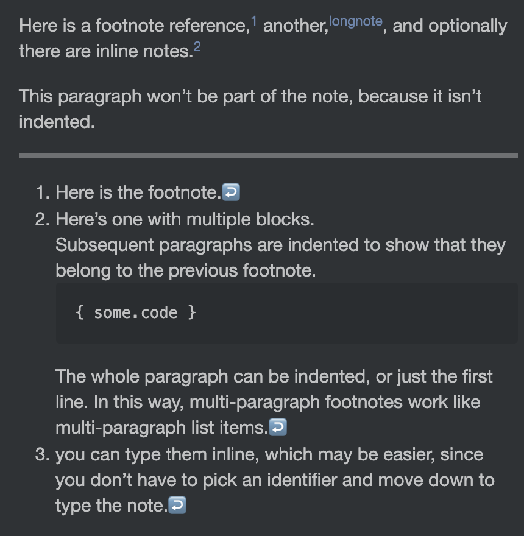

# Footnotes plugin for Inkdrop

Enables reference footnotes and inline footnotes.
Both are wrapped in square brackets and preceded by a caret (`^`), and can be referenced from inside other footnotes.

## Install

```sh
ipm install footnotes
```

## How to use

```markdown
Something something[^or something?].

And something else[^2].

[^2]: This reference footnote contains a paragraph...

  - ...and a list
```

It produces:


